

  
  
  
  

 

<!-- ═══════════ SHARE ═══════════ -->

---

## 🫧 关于我

开发 → 自动化测试 → 数据产品经理 → AI 创作者。

这些年，我看过无数的代码和数据。最复杂的系统，都可以被建模、被呈现、被优化。

但人的内心不行。

那些堵在胸口、卡在喉咙、说又说不清的感受——没有接口、没有日志、没有任何调试工具能告诉你它卡在哪一行。

所以现在的我，用了更多的时间去做这件事：

创作情绪插图、文案、和交互式数字体验。
把那些无形的、无名的、无处安放的情绪，
翻译成可以被看见、被触碰、被释放的形状。

让每一个说不清的情绪，都有一个具体的表达。

---

## 🎨 画廊

<h3 align="center" style="color:#4493f8;">🖱️ 左右滑动浏览更多 →</h3>

<pre style="background:transparent;border:none;font:inherit;padding:8px 0;margin:0;overflow-x:auto;">
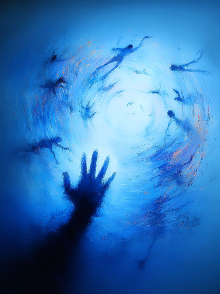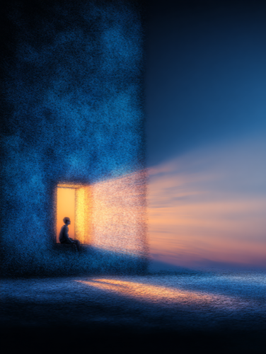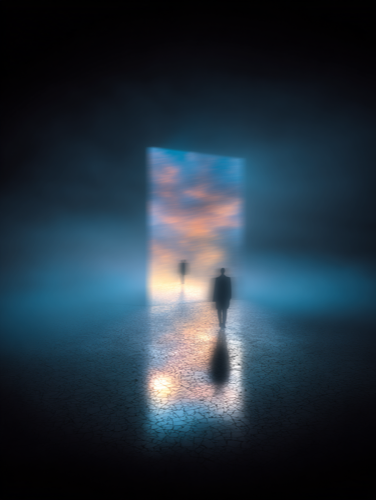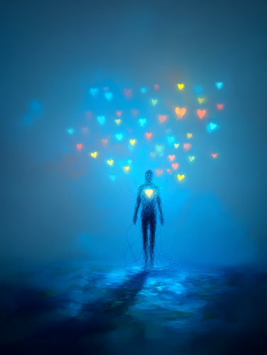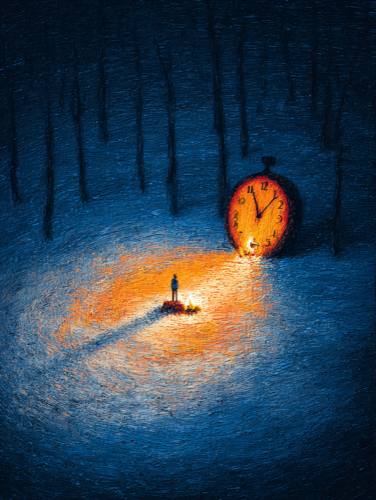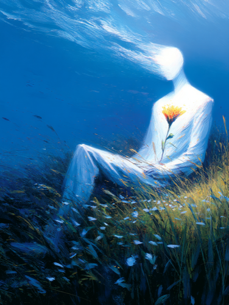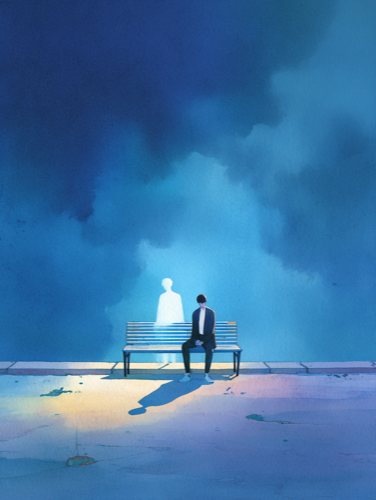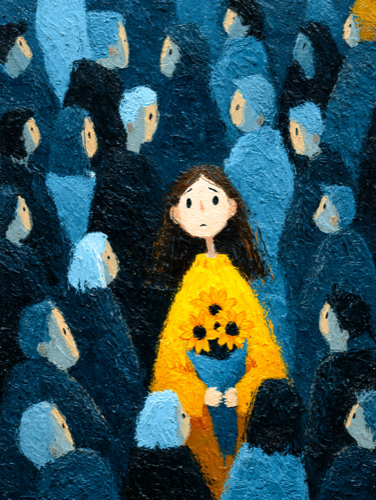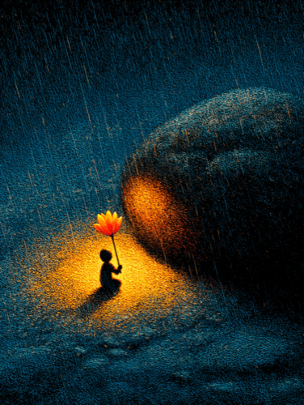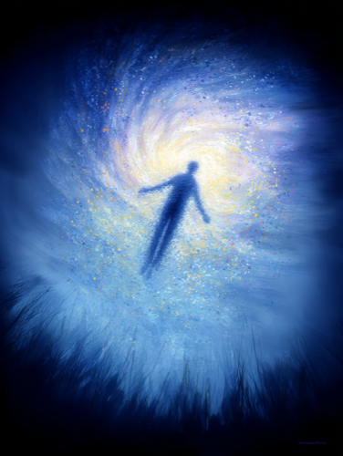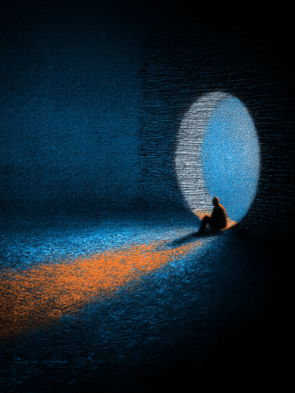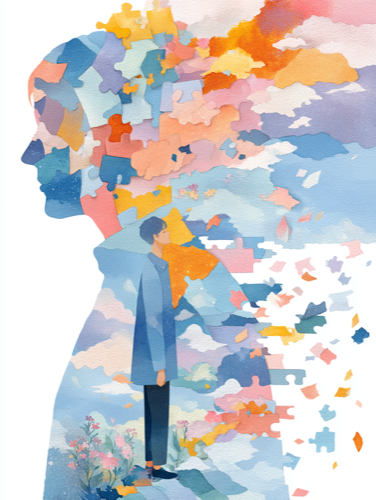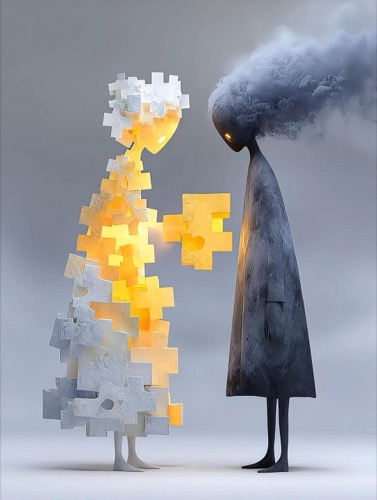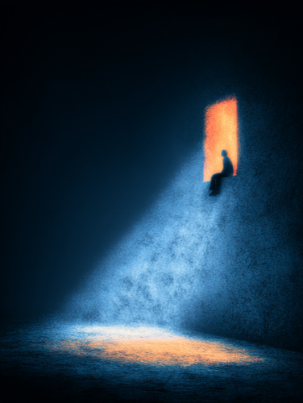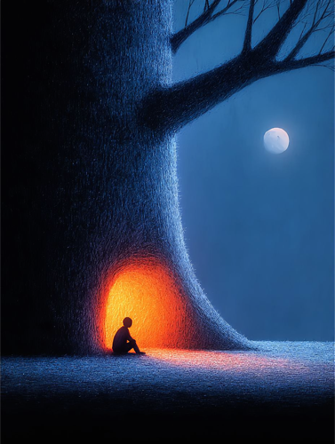
</pre>

---

## 🌀 Healing Visual Lab · 视觉疗愈实验室

### ✦ 最新作品

<!-- LATEST_WORKS_START -->
<table width="100%">
<tr><th width="30%">作品</th><th  width="70%">一句话</th></tr>
<tr><td><b><a href="https://shasha1108.github.io/healing-visual-lab/crystal-turntable/crystal-turntable.html">雪夜晶莹唱片机 / Crystal Turntable</a></b></td><td>屋外雪花纷飞，这里的旋律永远为你温暖。</td></tr>
<tr><td><b><a href="https://shasha1108.github.io/healing-visual-lab/sunken-treasure/sunken-treasure.html">Sunken Treasure</a></b></td><td>像素鱼游进掌机传送门，逃逸到 3D 水晶水体中，蜕变为优雅的矢量鱼</td></tr>
<tr><td><b><a href="https://shasha1108.github.io/healing-visual-lab/drift-bottle/drift-bottle.html">平行世界 · 漂流瓶生态系统 / Drift Bottle</a></b></td><td>轻触漂流瓶，唤醒瓶中平行世界</td></tr>
<tr><td><b><a href="https://shasha1108.github.io/healing-visual-lab/sunken-ipod/sunken-ipod.html">沉水 MP3 / Sunken iPod</a></b></td><td>深海之底，一首七里香。触碰水面，音符如气泡升起。</td></tr>
<tr><td><b><a href="https://shasha1108.github.io/healing-visual-lab/dreamcore-summer-rain/dreamcore-summer-rain.html">七里香 / Dreamcore Summer Night</a></b></td><td>极致冷暖光碰撞 — 深黑蓝天 vs 售货机刺眼白光 vs 铁路脉冲红灯</td></tr>
</table>
<!-- LATEST_WORKS_END -->

<h3 align="center">
  <a href="https://shasha1108.github.io/healing-visual-lab/">探索全部作品 →</a>
</h3>

  <em>If one of these pieces made you feel seen — that's the only reason this exists.</em>
   
  <em>如果其中某件作品让你感到被看见——那就是这些代码存在的全部意义。</em>

  
  &ensp;
  如果某件作品触动了你，⭐ Star 让更多人也能找到它。

---

## 🛠️ 能力光谱

<table width="100%">
<tr><th width="30%">能力</th><th width="70%">说明</th></tr>
<tr><td>🔀 系统化拆解</td><td>把混乱需求拆成闭环 —— 输入 → 判断 → 输出 → 反馈 → 迭代</td></tr>
<tr><td>🤖 Agent & Skill 开发</td><td>从规则定义到兜底逻辑，让 AI 真的能替人干活。不是写 prompt，是设计系统</td></tr>
<tr><td>🎬 AI 内容创作</td><td>图文 · 视频 · 文案 · 应用。用什么工具不重要，能准确表达就行</td></tr>
<tr><td>🎯 创作判断力</td><td>知道什么内容能打动人，什么形式适合什么情绪，什么不值得做</td></tr>
<tr><td>🧬 知识工程化</td><td>把个人经验变成结构化规则。系统越用越聪明，人不在了规则还在</td></tr>
</table>

---

---

  Sha.w.z · <a href="README_EN.md">English</a>

Source code under <a href="LICENSE">MIT License</a> | 网站源代码采用 MIT 协议

