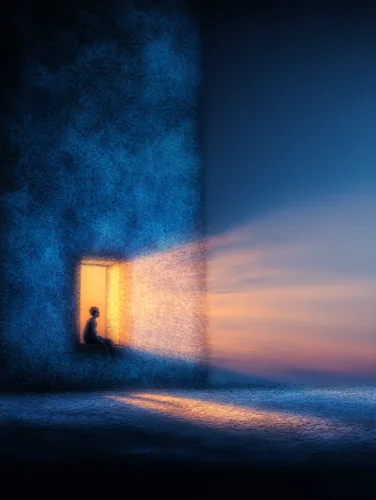
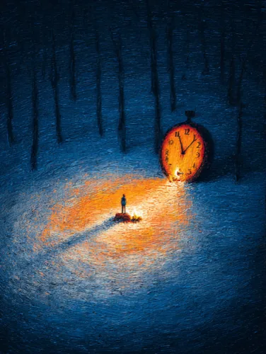
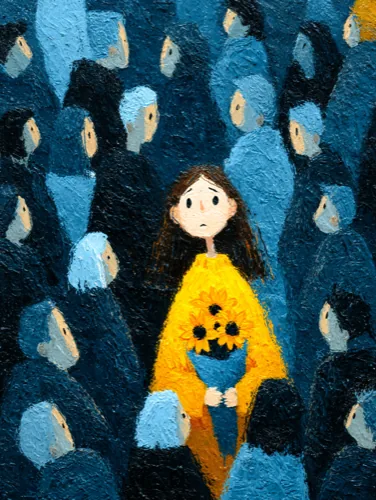
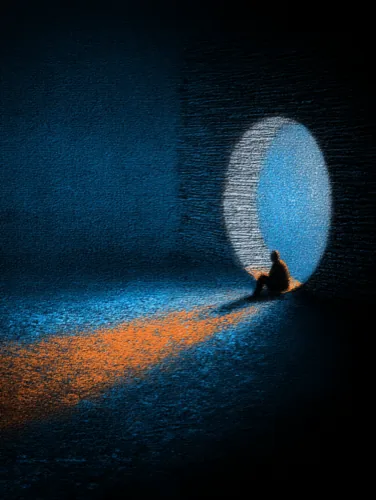
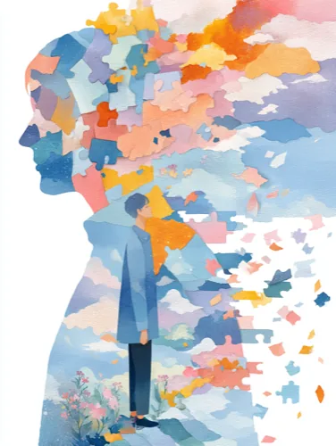

# Sha.w.z / 云野自由 (Yunye Ziyou) · Living Instrument Room

**AI Systems Builder**

> A responsive instrument for what cannot yet be said.

This is neither a project cabinet nor a skills list. It is a working instrument room: images, gestures, time, and memory are held inside revisitable systems that begin only when someone comes close.

> I do not build one-size-fits-all Agents.
> I build instruments that can hold a specific creative judgment.
> Some hold the unspoken emotions; some hold creative work; some hold evidence.

[Open an instrument](#02--three-flagships) · [See the frames](#01--frame-archive) · [中文](README.md)

## 01 / Frame archive

_Static horizontal recognition gallery (same configuration and order as the site)_

<table>
<tr>
<td align="center" data-gallery-id="115">

</td>
<td align="center" data-gallery-id="114">

</td>
<td align="center" data-gallery-id="116">

</td>
<td align="center" data-gallery-id="100">

</td>
<td align="center" data-gallery-id="102">

</td>
<td align="center" data-gallery-id="103">

</td>
<td align="center" data-gallery-id="104">

</td>
<td align="center" data-gallery-id="105">

</td>
<td align="center" data-gallery-id="106">

</td>
<td align="center" data-gallery-id="107">

</td>
<td align="center" data-gallery-id="108">

</td>
<td align="center" data-gallery-id="109">

</td>
<td align="center" data-gallery-id="110">

</td>
<td align="center" data-gallery-id="111">

</td>
<td align="center" data-gallery-id="112">

</td>
<td align="center" data-gallery-id="113">

</td>
<td align="center" data-gallery-id="117">

</td>
<td align="center" data-gallery-id="118">

</td>
<td align="center" data-gallery-id="119">

</td>
<td align="center" data-gallery-id="120">

</td>
<td align="center" data-gallery-id="121">

</td>
</tr>
</table>

_Work facts come from a local read-only Healing Visual Lab snapshot (origin/main)._

## 02 / Three flagships

### [Eternal Bloom](https://shasha1108.github.io/healing-visual-lab/eternal-bloom/eternal-bloom.html)

1. **What it holds** — It holds the suspension of “I am afraid it will disappear”: a bloom is allowed to continue rather than being rushed into a single explanation.
2. **What the visitor must do** — The visitor must tune the flower's colour, form, or rhythm first, rather than receiving comfort already completed for them.
3. **How the system decides** — The system reads only explicit parameters and touch. It does not infer an emotion or name the flower for a person.
4. **How the world responds** — Parameters and touch alter the bloom while sound arrives with it. The response is visible without demanding an account.
5. **Why this interaction must be this way** — Only a small, deliberate choice makes the bell jar's continuing bloom care left by the visitor, rather than automated background animation.

<a href="https://shasha1108.github.io/healing-visual-lab/eternal-bloom/eternal-bloom.html" target="_blank" rel="noopener">Open ↗</a>

### [BOTTLED COSMOS](https://shasha1108.github.io/healing-visual-lab/bottled-cosmos/bottled-cosmos.html)

1. **What it holds** — It holds the immensity and brevity of “there is too much to see”: every star lives for thirty seconds, yet can rest in a bottle.
2. **What the visitor must do** — The visitor must choose when to approach and open the bottle. The homepage does not run a cosmos in the background for anyone.
3. **How the system decides** — The system treats that explicit entry as its only start condition, then gives stars a finite interval to appear, change, and go dark.
4. **How the world responds** — After entry, the stars run within their thirty seconds. The glass boundary makes an immense scale feel holdable.
5. **Why this interaction must be this way** — A cosmos must be opened by a person so brevity is not attention taken by an algorithm, but time deliberately chosen.

<a href="https://shasha1108.github.io/healing-visual-lab/bottled-cosmos/bottled-cosmos.html" target="_blank" rel="noopener">Open ↗</a>

### [Layered Mountains](https://shasha1108.github.io/healing-visual-lab/layered-mountains/layered-mountains.html)

1. **What it holds** — It holds moments that neither want to be fixed nor called lost: scattering is not loss, and gathering is not an obligation to stay.
2. **What the visitor must do** — The visitor must rest a gaze or pointer on the ridges. No personal account is required, only a willingness to stay.
3. **How the system decides** — The system uses the relation between raycasting and the particle landscape to decide local disturbance; it infers no psychological state from a visitor.
4. **How the world responds** — Blue-green ridges loosen, appear, and gather anew in local relation. The reply is a mountain seen differently, not a popup.
5. **Why this interaction must be this way** — Only an approach that changes the act of seeing preserves room for things to gather and scatter; turning it into a reward click would remove that room.

<a href="https://shasha1108.github.io/healing-visual-lab/layered-mountains/layered-mountains.html" target="_blank" rel="noopener">Open ↗</a>

## 03 / Responsive small worlds

### [Aquarium 2003](https://shasha1108.github.io/healing-visual-lab/aquarium-2003/aquarium-2003.html)

A childhood screensaver aquarium is worth reopening because it keeps a memory of the visit.

Primary gesture: feed, tap the glass softly, and stay to watch.

Response: the fish, sound, and retained traces of a visit change together.

<a href="https://shasha1108.github.io/healing-visual-lab/aquarium-2003/aquarium-2003.html" target="_blank" rel="noopener">Enter this work ↗</a>

### [The Tree That Remembers Wind](https://shasha1108.github.io/healing-visual-lab/tree-remembers-wind/tree-remembers-wind.html)

A gesture over its canopy becomes wind travelling through branches, so every return can begin another small expanse.

Primary gesture: brush across the canopy.

Response: wind, leaves, and pentatonic sound travel outward by distance.

<a href="https://shasha1108.github.io/healing-visual-lab/tree-remembers-wind/tree-remembers-wind.html" target="_blank" rel="noopener">Enter this work ↗</a>

### [Firefly Seed Jar](https://shasha1108.github.io/healing-visual-lab/firefly-seed-jar/firefly-seed-jar.html)

It is a bottle that can be cared for: seeds do not need to be rushed, and looking in again is itself permission.

Primary gesture: touch or hold an amber seed.

Response: a seed briefly sprouts; luminous tendrils and ripples appear inside the glass.

<a href="https://shasha1108.github.io/healing-visual-lab/firefly-seed-jar/firefly-seed-jar.html" target="_blank" rel="noopener">Enter this work ↗</a>

### [Tidal Moon Moss](https://shasha1108.github.io/healing-visual-lab/tidal-moon-moss/tidal-moon-moss.html)

Night is reduced to a bell jar. It asks for no completion, only waits for the next gentle knock.

Primary gesture: touch the bell jar.

Response: moon moss wakes, sending glow and tide-like waves outward.

<a href="https://shasha1108.github.io/healing-visual-lab/tidal-moon-moss/tidal-moon-moss.html" target="_blank" rel="noopener">Enter this work ↗</a>

### [Windmill Valley](https://shasha1108.github.io/healing-visual-lab/windmill-valley/windmill-valley.html)

The windmill listens and wind chimes answer; it is weather one can enter, not a one-time display.

Primary gesture: enter the valley and move toward wind and chimes.

Response: windmill, chimes, and ambient sound hand the reply from one to another.

<a href="https://shasha1108.github.io/healing-visual-lab/windmill-valley/windmill-valley.html" target="_blank" rel="noopener">Enter this work ↗</a>

### [Inner Weather Diary · 60s Oxygen Chamber](https://shasha1108.github.io/healing-visual-lab/oxygen-chamber/oxygen-chamber.html)

An emotion need not be named at once. Choosing weather and taking sixty seconds to breathe is a diary entrance designed for return.

Primary gesture: choose weather, then begin or end a 60-second breath.

Response: weather, pixel particles, and ambient sound shift inside the glass room.

<a href="https://shasha1108.github.io/healing-visual-lab/oxygen-chamber/oxygen-chamber.html" target="_blank" rel="noopener">Enter this work ↗</a>

## 04 / Three system benches

### 01 · Feeling Instruments

**PRIVATE SYSTEM / NO SOURCE LINK**

**Members** — healing-space / pixel-bloom / Healing Visual Lab

Turns hard-to-name feelings into experiences that require a human action and return a response state.

**Redacted flow** — `Feeling → metaphor → irreplaceable action → response state`

### 02 · Creative Instruments

**PRIVATE SYSTEM / NO SOURCE LINK**

**Members** — content-creation-router / inner-voice / echo-caption / duotone-screenprint / social-video-editor / h5-publish

Routes creative input through scene judgment and specialist executors while keeping final confirmation with the user.

**Redacted flow** — `Input → scene judgment → handoff → specialist executor → user confirmation`

### 03 · Evidence Instruments

**PRIVATE SYSTEM / NO SOURCE LINK**

**Members** — content-growth-advisor / yunye-growth-lab / creator-growth-workbench

Separates growth and creative judgment back into facts, inferences, and open validations before continuing with reviewable experiments.

**Redacted flow** — `Facts → inference → to be verified → single-variable experiment → real retrospective`

## 05 / What I refuse to automate

- I do not treat missing data as `0`.
- I do not write a completed publication as proof that growth happened.
- I do not confirm a user’s creative intent on their behalf.
- I do not let a formula replace a real reader goal.
- I do not let a click become an effect with no metaphorical meaning.
- I do not use a one-size-fits-all Agent to conceal the absence of professional judgment.

## 06 / Path and entrances

Development → QA automation → data products → an AI systems builder who engineers creative judgment

[Complete portfolio](https://shasha1108.github.io/healing-visual-lab/) · [Xiaohongshu](https://xhslink.com/m/1kVPy4geTiQ) · [GitHub](https://github.com/shasha1108) · [Contact via Xiaohongshu DM](https://xhslink.com/m/1kVPy4geTiQ)

No background iframes, no autoplaying H5: every instrument waits for an explicit entry.
