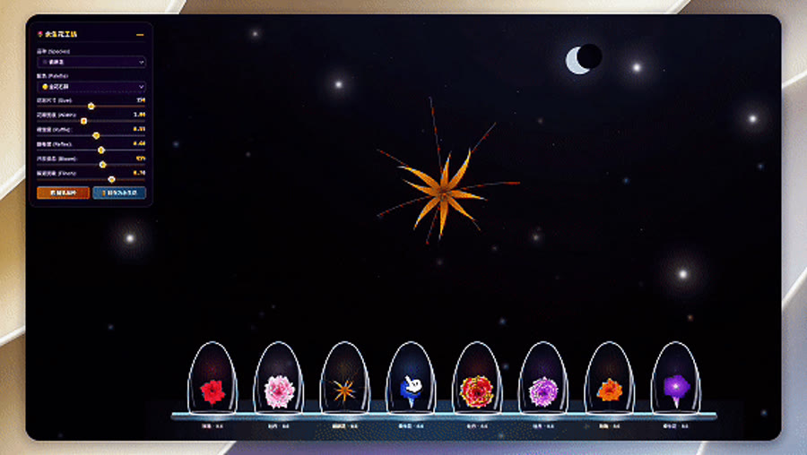
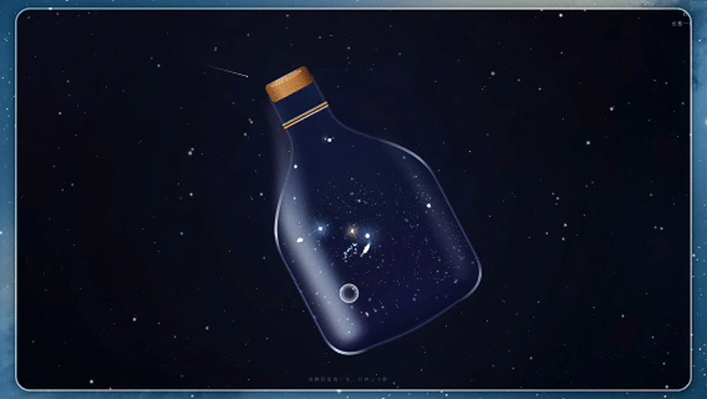
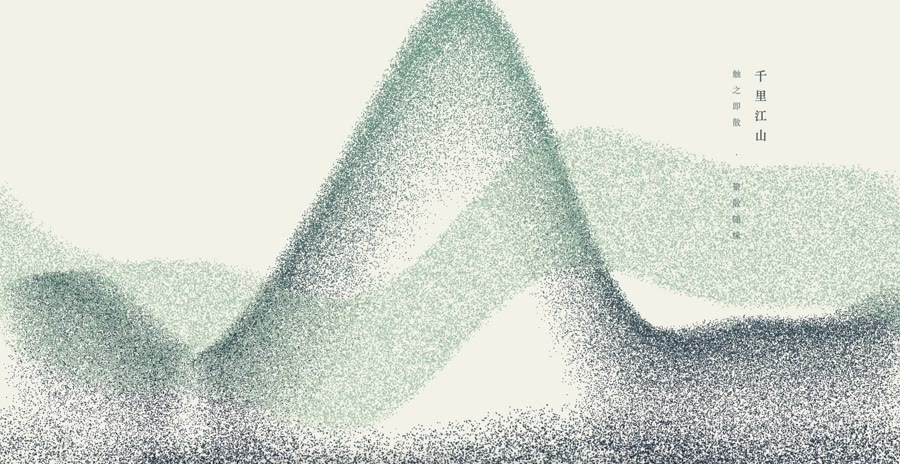

<!-- Generated from content/showcase.json by scripts/build_profile.py. Do not edit this file directly. -->

I use visual imagery, sound, and interaction to make small worlds you can touch and return to again and again. They begin with feelings that do not yet have a name, while leaving the final meaning with you.

<a href="https://xhslink.com/m/1kVPy4geTiQ">小红书 / Xiaohongshu</a> · <a href="https://shasha1108.github.io/healing-visual-lab/">Healing Visual Lab</a> · <a href="https://shasha1108.github.io/shasha1108/index.html">Personal site</a>

<table><tr>
<td width="33%"></td>
<td width="33%"></td>
<td width="33%"></td>
</tr></table>

## 🫧 About

I have spent years with code and data. Complex systems can be modelled, visualised, and debugged—but an inner life cannot.

Development → QA automation → data product management.

I learned to make complex systems visible, then became more interested in feelings with no interface, no logs, and no easy name.

So I began shaping images, sound, and interaction into small worlds—places where feelings that are hard to name can stay for a while.

I do not rush to define a feeling or make a creator's final choice for them. To me, technology is more like a craft: slowly making what is hard to say into experiences that can be seen and touched.

## Perhaps these are the images through which you know me.

These images hold colours and light I have always loved, along with feelings I have not yet found words for. Move through the long reel slowly, or open the complete gallery.

<h3 align="center">🖱️ Scroll sideways to see more →</h3>

<pre style="background:transparent;border:none;font:inherit;padding:8px 0;margin:0;overflow-x:auto;">

</pre>

## I turn these feelings into small worlds.

They do not explain a feeling for you. A touch or a pause changes the world in front of you.

<table><tr>
<td width="33%" valign="top">
 
<strong>Eternal Bloom</strong> 
Tune every part of a flower, seal it beneath glass, and it will keep blooming for you.  
<a href="https://shasha1108.github.io/healing-visual-lab/eternal-bloom/eternal-bloom.html">Enter the work ↗</a>
</td>
<td width="33%" valign="top">
 
<strong>BOTTLED COSMOS</strong> 
Place an entire cosmos inside a glass bottle—each star has only thirty seconds to live.  
<a href="https://shasha1108.github.io/healing-visual-lab/bottled-cosmos/bottled-cosmos.html">Enter the work ↗</a>
</td>
<td width="33%" valign="top">
 
<strong>Layered Mountains</strong> 
Touch, and the mountains scatter. Gathering and parting follow their own course.  
<a href="https://shasha1108.github.io/healing-visual-lab/layered-mountains/layered-mountains.html">Enter the work ↗</a>
</td>
</tr></table>

## They live quietly, and wait for your return

### [Aquarium 2003](https://shasha1108.github.io/healing-visual-lab/aquarium-2003/aquarium-2003.html)

A childhood screensaver aquarium is worth reopening because it keeps a memory of the visit.

### [The Tree That Remembers Wind](https://shasha1108.github.io/healing-visual-lab/tree-remembers-wind/tree-remembers-wind.html)

A gesture over its canopy becomes wind travelling through branches, so every return can begin another small expanse.

### [Firefly Seed Jar](https://shasha1108.github.io/healing-visual-lab/firefly-seed-jar/firefly-seed-jar.html)

It is a bottle that can be cared for: seeds do not need to be rushed, and looking in again is itself permission.

### [Tidal Moon Moss](https://shasha1108.github.io/healing-visual-lab/tidal-moon-moss/tidal-moon-moss.html)

Night is reduced to a bell jar. It asks for no completion, only waits for the next gentle knock.

### [Windmill Valley](https://shasha1108.github.io/healing-visual-lab/windmill-valley/windmill-valley.html)

The windmill listens and wind chimes answer; it is weather one can enter, not a one-time display.

### [Inner Weather Diary · 60s Oxygen Chamber](https://shasha1108.github.io/healing-visual-lab/oxygen-chamber/oxygen-chamber.html)

An emotion need not be named at once. Choosing weather and taking sixty seconds to breathe is a diary entrance designed for return.

<strong>If you also wonder how these experiences are made</strong>

### Turning Feeling into Experience

Starts with a feeling that is hard to name, then finds an action that only means something when a person completes it.

healing-space / pixel-bloom / Healing Visual Lab

### Making Creative Workflows Reliable

Gives each idea to the right creative tool while leaving the final decision with the creator.

content-creation-router / inner-voice / echo-caption / duotone-screenprint / social-video-editor / h5-publish

### Keeping Judgment Evidence-Bound

Keeps facts, inferences, and open questions separate so growth never eclipses real readers or the work itself.

content-growth-advisor / yunye-growth-lab / creator-growth-workbench

## From code toward feeling

Development → QA automation → data product management → using technology to turn feelings and creative ideas into experiences

<h3><a href="https://github.com/shasha1108/shasha1108/blob/main/README.md">中文 →</a></h3>

---

<em>If one of these pieces made you feel seen—that is the only reason this code exists.</em>  Sha.w.z / 云野自由 (Yunye Ziyou)

